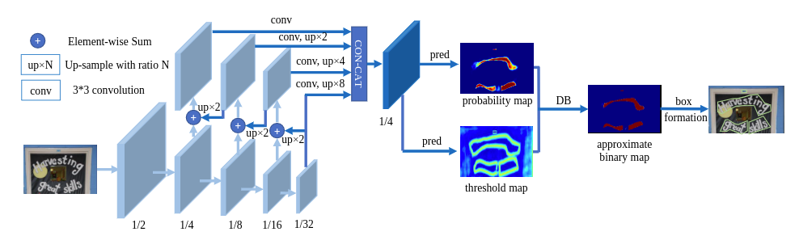

# 仓库介绍

本项目同时用MindSpore框架同时实现了dbnet和dbnet++两个模型。dbnet模型没有dcn算子时，模型在icdar2015上测试的精度可以达标。由于框架dcn算子好像存在一些问题，当加入dcn算子时，精度不达标。

 同时，代码也适配了TotalText和cocotext两个数据集，config文件中提供了相应的配置。

# 精度

| 模型           | Pretrained Model | Training set    | Test set       | epochs | Recall | Precision | Fmeasure |
| -------------- | ---------------- | --------------- | -------------- | ------ | ------ | --------- | -------- |
| DBNet_resnet18 | ImageNet         | ICDAR2015 Train | ICDAR2015 Test | 1200   | 0.778  | 0.839     | 0.808    |

预训练模型与精度达标模型的checkpoint下载：百度网盘

https://pan.baidu.com/s/1qLbf6uaUT7_9bpeBP6Zs8w?pwd=giu4

提取码：giu4 

# DBNet描述

近年来，基于分割的方法在场景文本检测中非常流行，因为分割结果可以更准确地描述各种形状的场景文本，如曲线文本。然而，二值化的后处理对于基于分割的检测是必不可少的，该检测将由分割方法生成的概率图转换为文本的边界框/区域。DBNet论文中提出了一个名为可微分二值化（DB）的模块，它可以在分割网络中执行二值化过程。与DB模块一起优化的分割网络可以自适应地设置二值化阈值，这不仅简化了后处理，而且提高了文本检测的性能。基于一个简单的分割网络，我们在五个基准数据集上验证了DB的性能改进，在检测精度和速度方面，DB始终达到了最先进的结果。特别是，对于轻量级主干，DB的性能改进非常显著，因此我们可以在检测精度和效率之间寻找理想的折衷。

论文：

[Real-time Scene Text Detection with Differentiable Binarization](https://arxiv.org/abs/1911.08947)

# 模型架构



# 数据集

使用的数据集：[ICDAR2015](<https://rrc.cvc.uab.es/?ch=4&com=downloads>)

- 数据集大小：132M
    - 训练集：
      - 图片：88.5M（1000张图片）
      - 标签：157KB
    - 测试集：
      - 图片：43.3M(500张图片)
      - 标签：244KB
- 数据格式：图片，标签

# 环境要求

- 硬件（Ascend/GPU/CPU）
    - 使用Ascend/GPU/CPU处理器来搭建硬件环境。
- 框架
    - [MindSpore](https://www.mindspore.cn/install/en)
- 如需查看详情，请参见如下资源：
    - [MindSpore教程](https://www.mindspore.cn/tutorials/zh-CN/master/index.html)
    - [MindSpore Python API](https://www.mindspore.cn/docs/zh-CN/master/index.html)

# 快速入门

通过官方网站安装MindSpore后，您可以按照如下步骤进行训练和评估：

- Ascend处理器环境运行

  单卡训练：
  
  ```
  sh run_standalone_train.sh [CONFIG_PATH] [DEVICE_ID]
  ```
  
  多卡训练：
  
  ```
  sh run_distribution_train_ascend.sh [DEVICE_NUM] [START_ID] [RANK_TABLE_FILE] [CONFIG_PATH]
  ```
  
  checkpoints精度评估：
  
  ```
  sh run_eval.sh [CONFIG_PATH] [CKPT_PATH] [DEVICE_ID]
  ```
  

# 脚本说明

## 脚本及样例代码

```bash
.
├── config
│   ├── icdar2015
│   │   └── dbnet
│   │       ├── config_resnet18_1p.yaml
│   │       ├── config_resnet18_8p.yaml
│   │       ├── config_resnet50_1p.yaml
│   │       └── config_resnet50_8p.yaml
│   └── TotalText
│       └── dbnet
│           ├── config_resnet18_1p.yaml
│           ├── config_resnet18_8p.yaml
│           ├── config_resnet50_1p.yaml
│           └── config_resnet50_8p.yaml
├── datasets
│   ├── __init__.py
│   ├── load.py
│   ├── pre_process.py
│   └── random_thansform.py
├── modules
│   ├── backbone.py
│   ├── detector.py
│   ├── __init__.py
│   ├── loss.py
│   └── model.py
├── utils
    ├── asf.py
    ├── callback.py
    ├── env.py
    ├── eval_utils.py
    ├── __init__.py
    ├── learning_rate.py
    ├── metric.py
    └──  post_process.py
├── convert.py
├── eval.py
├── export_eval_picture_bin.py
├── export_MindIR.py
├── README.md
└── train.py

```

## 脚本参数

在./config/./config_... p.yaml中可以同时配置训练参数和评估参数。

例如：icdar2015训练集、resnet18、单卡训练脚本

```
net: DBnet
seed: 1
run_eval: True
eval_iter: 20
device_target: "Ascend"
context_mode: "graph"
mix_precision: True
backbone:
    initializer: resnet18
    pretrained: True
    pretrained_ckpt: "/old/zhaoting/resnet18-5c106cde.ckpt"
segdetector:
    in_channels: [64, 128, 256, 512]  #R50: [256, 512, 1024, 2048]  R18: [64, 128, 256, 512]
    inner_channels: 256
    k: 50
    bias: False
    adaptive: True
    serial: False
loss:
    eps: 0.000001
    l1_scale: 10
    bce_scale: 5
    bce_replace: bceloss # diceloss / focalloss / bceloss
optimizer:
    type: sgd
    lr:
        base_lr: 0.007
        target_lr: 0.0
        warmup_epoch: 3
        factor: 0.9
    momentum: 0.9
    weight_decay: 0.0001
dataset:
    class: IC2015Dataloader
    is_show: False
    is_icdar2015: True
    num_workers: 12
    prefetch_size: 12
    short_side: 736
    random_angle: [-10, 10]
    random_crop:
        max_tries: 100
        min_crop_side_ratio: 0.1
train:
    img_format: '.jpg'
    img_dir: "/home/mindspore/wjf/dbnet/data/train_images/"
    gt_dir: "/home/mindspore/wjf/dbnet/data/train_gts/"
    start_epoch_num: 0
    total_epochs: 1200
    batch_size: 16
    save_steps: 630
    max_checkpoints: 5
    is_transform: True
    is_eval_before_saving: True
    shrink_ratio: 0.4
    min_text_size: 8
    thresh_min: 0.3
    thresh_max: 0.7
    dataset_sink_mode: False
eval:
    img_format: '.jpg'
    img_dir: "/home/mindspore/wjf/dbnet/data/test_images/"
    gt_dir: "/home/mindspore/wjf/dbnet/data/test_gts/"
    show_images: False
    image_dir: './outputs_test/'
    thresh: 0.3
    box_thresh: 0.55
    max_candidates: 1000
    unclip_ratio: 1.5
    polygon: False
    dest: binary

```


更多配置细节请参考具体文件。

## 训练过程

### 训练

- Ascend处理器环境运行

  ```bash
  sh run_standalone_train.sh [CONFIG_PATH] [DEVICE_ID]
  ```

  上述命令将在后台运行，您可以通过standalone_train.txt文件查看结果。

  训练结束后，您可在默认脚本文件夹下找到检查点文件。采用以下方式达到损失值：

  ```bash
  # grep "loss is " standalone_train.txt
  [2022-10-26 23:31:15] epoch: 1 step:  1, loss is 26.153379
  [2022-10-26 23:31:15] epoch: 1 step:  2, loss is 27.153784
  [2022-10-26 23:31:16] epoch: 1 step:  3, loss is 25.791908
  ......
  ```

  模型检查点保存在当前目录下。


### 分布式训练

- Ascend处理器环境运行

  ```bash
  sh run_distribution_train_ascend.sh [DEVICE_NUM] [START_ID] [RANK_TABLE_FILE] [CONFIG_PATH]
  ```

  上述shell脚本将在后台运行分布训练。您可以通过train_parallel0/log.txt文件查看结果。采用以下方式达到损失值：

  ```bash
  # grep "result:" train_parallel*/log
  [2022-10-26 11:28:16] epoch: 1 step: 15, loss is 3.393731
  [2022-10-26 11:28:16] epoch: 1 cast 191728.519201 ms, per tep time: 12781.901280 ms
  [2022-10-26 11:28:18] epoch: 2 step: 15, loss is 3.677468
  [2022-10-26 11:28:18] epoch: 2 cast 2823.748827 ms, per tep time: 188.249922 ms
  [2022-10-26 11:28:21] epoch: 3 step: 15, loss is 3.469740
  [2022-10-26 11:28:21] epoch: 3 cast 2792.260170 ms, per tep time: 186.150678 ms
  ...
  ```
  

## 评估过程

### 评估

- 在Ascend环境运行时评估指定模型。

  在运行以下命令之前，请检查用于评估的检查点路径。请将检查点路径设置为绝对全路径.

  ```bash
  sh run_eval.sh [CONFIG_PATH] [CKPT_PATH] [DEVICE_ID]
  ```

  上述python命令将在后台运行，您可以通过eval.log文件查看结果。测试数据集的准确性如下：

  ```bash
  # grep "accuracy:" eval.log
  0it [00:00, ?it/s]
  1it [00:11, 11.79s/it]
  2it [00:11,  4.92s/it]
  ...
  497it [01:02, 12.29it/s]
  499it [01:02, 12.32it/s]
  500it [01:02,  7.94it/s]
  FPS: 9.696992070973915
  Recall: 0.778153697438376
  Precision: 0.8394160583941606
  Fmeasure: 0.8076247755439164
  ```


### 导出

需要指定checkpoint路径和对应模型的config文件路径，已经导出机器的id。

导出MindIR命令如下：

```shell
python export_MindIR.py --checkpoint_path [checkpoint_path] --device_id [device_id] --config_path [config_path]
例如：
python export_MindIR.py --checkpoint_path ./best_epoch.ckpt --device_id 6 --config_path ./config/icdar2015/dbnet/config_resnet18_1p.yaml
```

## 推理过程

**推理前需参照 [环境变量设置指引](https://gitee.com/mindspore/models/tree/master/utils/ascend310_env_set/README_CN.md) 进行环境变量设置。**

### 310推理

- 数据集准备：

  准备ICADR数据集，在模型对应的config文件中指定路径。在910机器环境下，终端输入命令：

  ```
  python export_eval_picture_bin.py --config_path [config path] --device_id [device id]
  ```
  
  导出测试数据集和标签的二进制文件，在’./eval_bin’目录下。

- 导出MindIR模型：

  ```
  python export_MindIR.py --config_path [config path] --device_id [device id] --checkpoint_path [checkpoint path]
  ```

  导出checkpoint文件的MindIR模型。

- 推理（按照readme说明给出自验执行命令）：

    ```
    bash run_infer_310.sh [MINDIR_PATH] [DATASET_PATH] [CONFIG_PATH] [DEVICE_ID]
    ```
    
    (注：[DATASET_PATH]即为第1步中，eval_bin文件夹路径)
    
- 获取精度：

    ```
    cat acc.log
    ```

    

# 模型描述

## 性能

### 训练性能

#### ICDAR2015上训练DBNet

| 参数          | Ascend                                                     |
| ------------- | ---------------------------------------------------------- |
| 模型版本      | DBNet resnet18                                             |
| 资源          | Ascend 910；系统 ntos-releaseCentOS Linux release 8.5.2111 |
| 上传日期      | 2022-10-27                                                 |
| MindSpore版本 | 1.8.1                                                      |
| 数据集        | ICDAR2015                                                  |
| 训练参数      | epoch=120, steps=62, batch_size = 16, lr=0.7               |
| 优化器        | SDG                                                        |
| 损失函数      | 自定义损失函数                                             |
| 输出          | 概率图                                                     |
| 损失          | 0.67                                                       |
| 速度          | 单卡：404.2毫秒/步;  8卡：190毫秒/步                       |
| 总时长        | 单卡：？分钟;  8卡：2.8小时                                |
| 微调检查点    | 48M (.ckpt文件)                                            |
| 推理模型      | 48M(.MindIR文件)                                           |


### 评估性能

#### ICDAR2015上评估DBNet

| 参数           | Ascend                                                     |
| -------------- | ---------------------------------------------------------- |
| 模型版本       | DBNet resnet18                                             |
| 资源           | Ascend 910；系统 ntos-releaseCentOS Linux release 8.5.2111 |
| 上传日期       | 2022-10-27                                                 |
| MindSpore 版本 | 1.8.1                                                      |
| 数据集         | ICDAR2015                                                  |
| batch_size     | 1                                                          |
| 输出           | 文字框                                                     |
| 准确性         | 单卡: 80.7%;  8卡：79.6%                                   |
| 推理模型       | 48M (.ckpt文件)                                            |


### 迁移学习

待补充

# ModelZoo主页

 请浏览官网[主页](https://gitee.com/mindspore/models)。